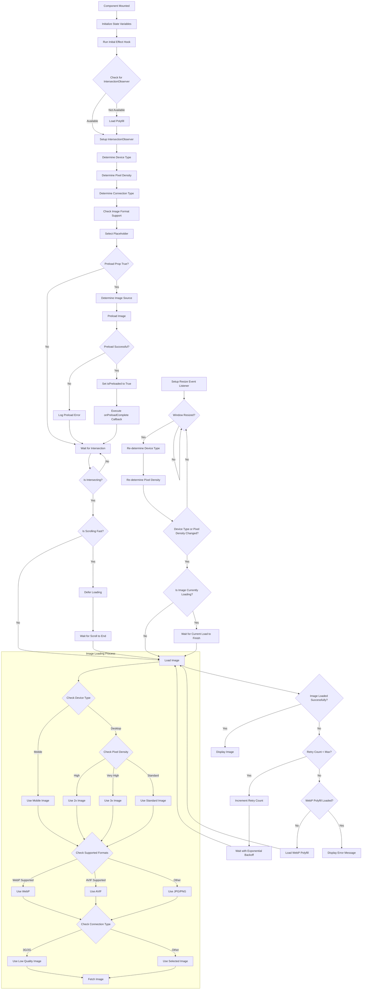

```mermaid
graph TD
    A[Component Mounted] --> B[Initialize State Variables]
    B --> C[Run Initial Effect Hook]
    C --> D{Check for IntersectionObserver}
    D -->|Available| E[Setup IntersectionObserver]
    D -->|Not Available| F[Load Polyfill]
    F --> E
    E --> G[Determine Device Type]
    G --> H[Determine Pixel Density]
    H --> I[Determine Connection Type]
    I --> J[Check Image Format Support]
    J --> K[Select Placeholder]
    K --> L{Preload Prop True?}
    L -->|Yes| M[Determine Image Source]
    L -->|No| N[Wait for Intersection]
    M --> O[Preload Image]
    O --> P{Preload Successful?}
    P -->|Yes| Q[Set isPreloaded to True]
    P -->|No| R[Log Preload Error]
    Q --> S[Execute onPreloadComplete Callback]
    R --> N
    S --> N
    N --> T{Is Intersecting?}
    T -->|Yes| U{Is Scrolling Fast?}
    U -->|No| V[Load Image]
    U -->|Yes| W[Defer Loading]
    W --> X[Wait for Scroll to End]
    X --> V
    V --> Y{Image Loaded Successfully?}
    Y -->|Yes| Z[Display Image]
    Y -->|No| AA{Retry Count < Max?}
    AA -->|Yes| AB[Increment Retry Count]
    AB --> AC[Wait with Exponential Backoff]
    AC --> V
    AA -->|No| AD{WebP Polyfill Loaded?}
    AD -->|No| AE[Load WebP Polyfill]
    AE --> V
    AD -->|Yes| AF[Display Error Message]
    T -->|No| N

    AG[Setup Resize Event Listener] --> AH{Window Resized?}
    AH -->|Yes| AI[Re-determine Device Type]
    AI --> AJ[Re-determine Pixel Density]
    AJ --> AK{Device Type or Pixel Density Changed?}
    AK -->|Yes| AL{Is Image Currently Loading?}
    AL -->|No| V
    AL -->|Yes| AM[Wait for Current Load to Finish]
    AM --> V
    AK -->|No| AH
    AH -->|No| AH

    subgraph Image Loading Process
    V --> BA{Check Device Type}
    BA -->|Mobile| BB[Use Mobile Image]
    BA -->|Desktop| BC{Check Pixel Density}
    BC -->|High| BD[Use 2x Image]
    BC -->|Very High| BE[Use 3x Image]
    BC -->|Standard| BF[Use Standard Image]
    BB --> BG{Check Supported Formats}
    BD --> BG
    BE --> BG
    BF --> BG
    BG -->|WebP Supported| BH[Use WebP]
    BG -->|AVIF Supported| BI[Use AVIF]
    BG -->|Other| BJ[Use JPG/PNG]
    BH --> BK{Check Connection Type}
    BI --> BK
    BJ --> BK
    BK -->|3G/2G| BL[Use Low Quality Image]
    BK -->|Other| BM[Use Selected Image]
    BL --> BN[Fetch Image]
    BM --> BN
    end
```
