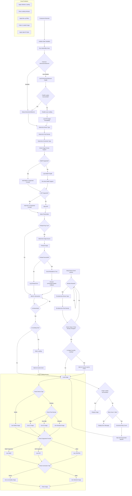

```mermaid
graph TD
    A[Component Mounted] --> B[Initialize State Variables]
    B --> C[Run Initial Effect Hook]
    C --> D{Check for IntersectionObserver}
    D -->|Available| E[Setup IntersectionObserver]
    D -->|Not Available| F[Load IntersectionObserver Polyfill]
    F --> G{Polyfill Loaded Successfully?}
    G -->|Yes| E
    G -->|No| H[Disable Lazy Loading]
    H --> I[Load All Images Immediately]
    E --> J[Determine Device Type]
    I --> J
    J --> K[Determine Pixel Density]
    K --> L[Determine Connection Type]
    L --> M[Check Image Format Support]
    M --> N{WebP Supported?}
    N -->|Yes| O[Add WebP to Supported Formats]
    N -->|No| P[Load WebP Polyfill]
    P --> Q[Re-check WebP Support]
    O --> R{AVIF Supported?}
    Q --> R
    R -->|Yes| S[Add AVIF to Supported Formats]
    R -->|No| T[Skip AVIF]
    S --> U[Select Placeholder]
    T --> U
    U --> V{Preload Prop True?}
    V -->|Yes| W[Determine Image Source]
    V -->|No| X[Wait for Intersection]
    W --> Y[Preload Image]
    Y --> Z{Preload Successful?}
    Z -->|Yes| AA[Set isPreloaded to True]
    Z -->|No| AB[Log Preload Error]
    AA --> AC[Execute onPreloadComplete Callback]
    AB --> X
    AC --> X
    X --> AD{Is Intersecting?}
    AD -->|Yes| AE{Is Scrolling Fast?}
    AE -->|No| AF[Load Image]
    AE -->|Yes| AG[Defer Loading]
    AG --> AH[Wait for Scroll to End]
    AH --> AF
    AF --> AI{Image Loaded Successfully?}
    AI -->|Yes| AJ[Display Image]
    AI -->|No| AK{Retry Count < Max?}
    AK -->|Yes| AL[Increment Retry Count]
    AL --> AM[Wait with Exponential Backoff]
    AM --> AF
    AK -->|No| AN[Display Error Message]
    AD -->|No| X

    AO[Setup Resize Event Listener] --> AP{Window Resized?}
    AP -->|Yes| AQ[Re-determine Device Type]
    AQ --> AR[Re-determine Pixel Density]
    AR --> AS{Device Type or Pixel Density Changed?}
    AS -->|Yes| AT{Is Image Currently Loading?}
    AT -->|No| AF
    AT -->|Yes| AU[Wait for Current Load to Finish]
    AU --> AF
    AS -->|No| AP
    AP -->|No| AP

    subgraph Image Loading Process
    AF --> BA{Check Device Type}
    BA -->|Mobile| BB[Use Mobile Image]
    BA -->|Desktop| BC{Check Pixel Density}
    BC -->|High| BD[Use 2x Image]
    BC -->|Very High| BE[Use 3x Image]
    BC -->|Standard| BF[Use Standard Image]
    BB --> BG{Check Supported Formats}
    BD --> BG
    BE --> BG
    BF --> BG
    BG -->|WebP Supported| BH[Use WebP]
    BG -->|AVIF Supported| BI[Use AVIF]
    BG -->|Other| BJ[Use JPG/PNG]
    BH --> BK{Check Connection Type}
    BI --> BK
    BJ --> BK
    BK -->|3G/2G| BL[Use Low Quality Image]
    BK -->|Other| BM[Use Selected Image]
    BL --> BN[Fetch Image]
    BM --> BN
    end

    subgraph Visual Feedback
    BO[Apply Skeleton Loading]
    BP[Show Loading Indicator]
    BQ[Apply Blur-up Effect]
    BR[Fade-in Loaded Image]
    BS[Apply object-fit Style]
    end
```
