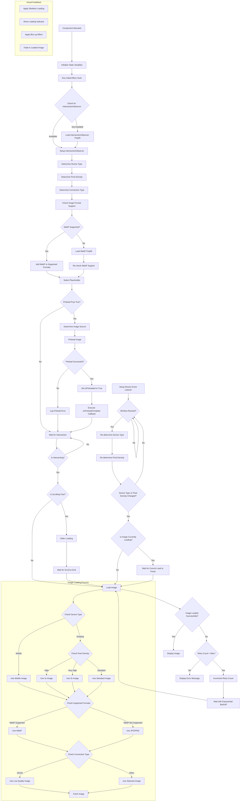

```mermaid
graph TD
    A[Component Mounted] --> B[Initialize State Variables]
    B --> C[Run Initial Effect Hook]
    C --> D{Check for IntersectionObserver}
    D -->|Available| E[Setup IntersectionObserver]
    D -->|Not Available| F[Load IntersectionObserver Polyfill]
    F --> E
    E --> G[Determine Device Type]
    G --> H[Determine Pixel Density]
    H --> I[Determine Connection Type]
    I --> J[Check Image Format Support]
    J --> K{WebP Supported?}
    K -->|Yes| L[Add WebP to Supported Formats]
    K -->|No| M[Load WebP Polyfill]
    M --> N[Re-check WebP Support]
    L --> O[Select Placeholder]
    N --> O
    O --> P{Preload Prop True?}
    P -->|Yes| Q[Determine Image Source]
    P -->|No| R[Wait for Intersection]
    Q --> S[Preload Image]
    S --> T{Preload Successful?}
    T -->|Yes| U[Set isPreloaded to True]
    T -->|No| V[Log Preload Error]
    U --> W[Execute onPreloadComplete Callback]
    V --> R
    W --> R
    R --> X{Is Intersecting?}
    X -->|Yes| Y{Is Scrolling Fast?}
    Y -->|No| Z[Load Image]
    Y -->|Yes| AA[Defer Loading]
    AA --> AB[Wait for Scroll to End]
    AB --> Z
    Z --> AC{Image Loaded Successfully?}
    AC -->|Yes| AD[Display Image]
    AC -->|No| AE{Retry Count < Max?}
    AE -->|Yes| AF[Increment Retry Count]
    AF --> AG[Wait with Exponential Backoff]
    AG --> Z
    AE -->|No| AH[Display Error Message]
    X -->|No| R

    AI[Setup Resize Event Listener] --> AJ{Window Resized?}
    AJ -->|Yes| AK[Re-determine Device Type]
    AK --> AL[Re-determine Pixel Density]
    AL --> AM{Device Type or Pixel Density Changed?}
    AM -->|Yes| AN{Is Image Currently Loading?}
    AN -->|No| Z
    AN -->|Yes| AO[Wait for Current Load to Finish]
    AO --> Z
    AM -->|No| AJ
    AJ -->|No| AJ

    subgraph Image Loading Process
    Z --> BA{Check Device Type}
    BA -->|Mobile| BB[Use Mobile Image]
    BA -->|Desktop| BC{Check Pixel Density}
    BC -->|High| BD[Use 2x Image]
    BC -->|Very High| BE[Use 3x Image]
    BC -->|Standard| BF[Use Standard Image]
    BB --> BG{Check Supported Formats}
    BD --> BG
    BE --> BG
    BF --> BG
    BG -->|WebP Supported| BH[Use WebP]
    BG -->|WebP Not Supported| BI[Use JPG/PNG]
    BH --> BJ{Check Connection Type}
    BI --> BJ
    BJ -->|3G/2G| BK[Use Low Quality Image]
    BJ -->|Other| BL[Use Selected Image]
    BK --> BM[Fetch Image]
    BL --> BM
    end

    subgraph Visual Feedback
    BN[Apply Skeleton Loading]
    BO[Show Loading Indicator]
    BP[Apply Blur-up Effect]
    BQ[Fade-in Loaded Image]
    end
```
