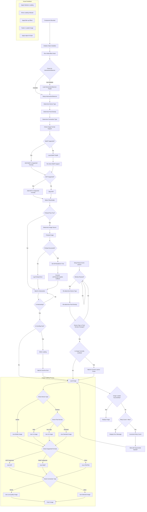

```mermaid
graph TD
    A[Component Mounted] --> B[Initialize State Variables]
    B --> C[Run Initial Effect Hook]
    C --> D{Check for IntersectionObserver}
    D -->|Available| E[Setup IntersectionObserver]
    D -->|Not Available| F[Load IntersectionObserver Polyfill]
    F --> E
    E --> G[Determine Device Type]
    G --> H[Determine Pixel Density]
    H --> I[Determine Connection Type]
    I --> J[Check Image Format Support]
    J --> K{WebP Supported?}
    K -->|Yes| L[Add WebP to Supported Formats]
    K -->|No| M[Load WebP Polyfill]
    M --> N[Re-check WebP Support]
    L --> O{AVIF Supported?}
    N --> O
    O -->|Yes| P[Add AVIF to Supported Formats]
    O -->|No| Q[Skip AVIF]
    P --> R[Select Placeholder]
    Q --> R
    R --> S{Preload Prop True?}
    S -->|Yes| T[Determine Image Source]
    S -->|No| U[Wait for Intersection]
    T --> V[Preload Image]
    V --> W{Preload Successful?}
    W -->|Yes| X[Set isPreloaded to True]
    W -->|No| Y[Log Preload Error]
    X --> Z[Execute onPreloadComplete Callback]
    Y --> U
    Z --> U
    U --> AA{Is Intersecting?}
    AA -->|Yes| AB{Is Scrolling Fast?}
    AB -->|No| AC[Load Image]
    AB -->|Yes| AD[Defer Loading]
    AD --> AE[Wait for Scroll to End]
    AE --> AC
    AC --> AF{Image Loaded Successfully?}
    AF -->|Yes| AG[Display Image]
    AF -->|No| AH{Retry Count < Max?}
    AH -->|Yes| AI[Increment Retry Count]
    AI --> AJ[Wait with Exponential Backoff]
    AJ --> AC
    AH -->|No| AK[Display Error Message]
    AA -->|No| U

    AL[Setup Resize Event Listener] --> AM{Window Resized?}
    AM -->|Yes| AN[Re-determine Device Type]
    AN --> AO[Re-determine Pixel Density]
    AO --> AP{Device Type or Pixel Density Changed?}
    AP -->|Yes| AQ{Is Image Currently Loading?}
    AQ -->|No| AC
    AQ -->|Yes| AR[Wait for Current Load to Finish]
    AR --> AC
    AP -->|No| AM
    AM -->|No| AM

    subgraph Image Loading Process
    AC --> BA{Check Device Type}
    BA -->|Mobile| BB[Use Mobile Image]
    BA -->|Desktop| BC{Check Pixel Density}
    BC -->|High| BD[Use 2x Image]
    BC -->|Very High| BE[Use 3x Image]
    BC -->|Standard| BF[Use Standard Image]
    BB --> BG{Check Supported Formats}
    BD --> BG
    BE --> BG
    BF --> BG
    BG -->|AVIF Supported| BH[Use AVIF]
    BG -->|WebP Supported| BI[Use WebP]
    BG -->|Other| BJ[Use JPG/PNG]
    BH --> BK{Check Connection Type}
    BI --> BK
    BJ --> BK
    BK -->|3G/2G| BL[Use Low Quality Image]
    BK -->|Other| BM[Use Selected Image]
    BL --> BN[Fetch Image]
    BM --> BN
    end

    subgraph Visual Feedback
    BO[Apply Skeleton Loading]
    BP[Show Loading Indicator]
    BQ[Apply Blur-up Effect]
    BR[Fade-in Loaded Image]
    BS[Apply object-fit Style]
    end
```
